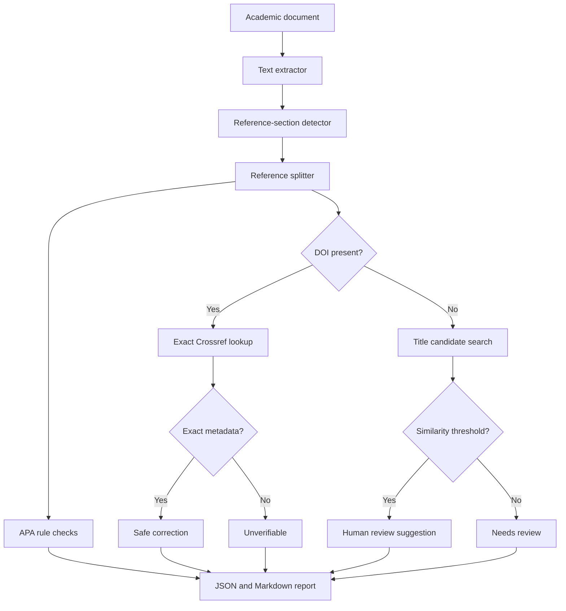

# Architecture and Roadmap

## Goal

The system is an evidence-bounded reference agent: it performs a multi-step workflow, calls external metadata tools, evaluates confidence, takes safe corrective action, and escalates uncertain cases to a person. It is not an unconstrained citation generator.

## PoC flow

## Modules

| Module | Responsibility |
|---|---|
| `extractors.py` | Input adapters and reference-section extraction |
| `references.py` | Entry splitting, DOI extraction, title guess |
| `providers/` | Replaceable metadata-provider interface and Crossref adapter |
| `apa.py` | Deterministic rule checks and supported formatters |
| `pipeline.py` | Orchestration, confidence policy, correction boundary |
| `reporting.py` | Stable JSON schema and human-readable outputs |
| `cli.py` | Command-line interface and exit behavior |
| `web/app.py` | FastAPI upload boundary and JSON API |
| `web/static/` | Responsive browser interface and client-side exports |

## Why no LLM in the first correction path

An LLM can help classify unusual reference types or recover malformed fields, but it should not be the source of truth for metadata. The PoC uses deterministic parsing plus external bibliographic evidence. Later versions can add an LLM as a bounded proposal tool whose output still requires provider corroboration or human approval.

## Production roadmap

### Phase 1 — harden the CLI

- Add OCR with explicit page-level confidence.
- Preserve DOCX runs and inspect italics/hanging indents.
- Add CSL-based formatting and more source types.
- Add OpenAlex, DataCite, PubMed, ISBN, and library-catalog providers.
- Merge provider evidence and expose field-level provenance.
- Add duplicate detection and in-text citation reconciliation.
- Add golden-file tests with multilingual references.

### Phase 2 — harden the service boundary

- Move long analyses from an in-process worker thread to a durable job queue.
- Store uploads encrypted with deletion/retention controls.
- Add rate limiting, structured logs, provider health metrics, and retry queues.
- Version the report schema and formatter rules.

### Phase 3 — expand the Web UI

- Add side-by-side field-level accept/reject controls.
- Add DOCX, RIS, BibTeX, and CSL-JSON exports.
- Persist opt-in projects and audit history behind authentication.
- Add internationalization and richer keyboard navigation tests.
- Never apply uncertain changes without an explicit user action.

## Security and privacy

- Treat uploaded documents as confidential by default.
- Send only the minimum citation query needed to metadata providers; do not upload full documents.
- Do not log document text or secrets.
- The current Web app validates the extension and size, stores each upload in a request-scoped temporary directory, and removes it after analysis.
- Before public multi-user deployment, add MIME sniffing, malware scanning, parser isolation, strict CPU/memory limits, rate limiting, and an explicit privacy notice.
